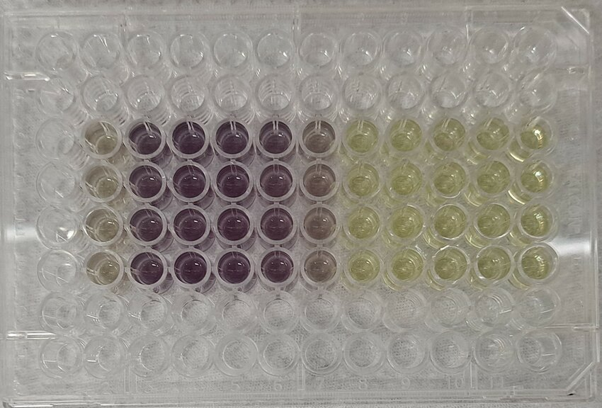
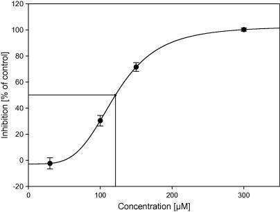

footer: MMiDD 2025 - Sofiene Khiari
slidenumbers: true
theme: Plain Jane, 1
autoscale: true

# Computer-Based Problem Solving
### Breaking Down Research Challenges

^ Welcome back! Today we're moving from understanding how computers work to actually solving real pharmaceutical research problems using computational thinking.

---

# What We Did Last Time

**You learned the fundamental building blocks:**
- **Variables** for storing information
- **Loops** for repeating actions
- **Conditionals** for making decisions
- **Files** for permanent storage
- **Computational thinking** - systematic problem-solving approach

^ These are the core concepts that power every computer program. Today we put them into practice.

---

# What We're Doing Today

**Your mission:**
- **Choose one** real drug development problem
- **Work in groups** to solve it together
- **Develop complete pseudocode** solution
- **Think through** all the logical steps and decisions

**Timeline:** You have about **60 minutes** to work on your chosen problem.

**Key mindset:** Do your best in the time available. This teaches you **time management** and **iterative problem-solving**. Perfect solutions aren't always necessary - focus on the best solution you can develop within the timeframe.

^ The focus today is on you doing the problem-solving work, not on me talking through slides.

---

# What is Pseudocode?

**Pseudocode = Plain English instructions for solving a problem**
- Detailed plan using everyday language
- Bridge between your ideas and actual programming code
- Like writing a recipe or instruction manual
- No programming syntax required


^ Think of pseudocode as writing step-by-step cooking instructions - specific enough that anyone can follow them.

---

# Why Pseudocode Matters

**Learning progression over 3 weeks:**
- **This week:** Develop pseudocode solutions 
- **Next week:** Learn Python programming syntax
- **Week after:** Translate your pseudocode into working Python code

**Benefit:** When you learn Python syntax next week, you'll already know exactly what you want to accomplish.

^ This approach makes programming much easier - you focus on logic first, syntax second.

---

# How to Write Good Pseudocode

**Key principles:**
1. **Use simple, clear language** - avoid technical jargon
2. **Be specific about steps** - don't just say "process the data"
3. **Include decision points** - IF/THEN logic for different situations
4. **Plan for problems** - what if data is missing or strange?
5. **Specify inputs and outputs** - what files do you read and create?

^ Your pseudocode should be detailed enough that someone else could implement it.

---

# Pseudocode Example

```plaintext
STEP 1: Read the data file
  Open the CSV file with compound data
  Store all the measurements in memory

STEP 2: Check data quality
  FOR each measurement:
    IF the value seems wrong (negative or too high):
      Flag it for review
      Decide whether to keep or exclude it
```

---

# Pseudocode Example

```plaintext
STEP 3: Calculate results
  FOR each compound:
    Calculate the average of good measurements
    Determine if compound is active or inactive

STEP 4: Create output
  Write results to a new CSV file
  Create a chart showing active compounds
```

^ Notice how this reads like instructions a person could follow step by step.

---

# Using AI Tools (ChatGPT, Claude, etc.)

**Let's be realistic:** You're probably going to use AI tools regardless of what I say.

**My approach:** I **encourage** you to use them, but use them **strategically**.

**Why this makes sense:**
- You'll use AI in your professional research career
- Learning to work **with** AI tools effectively is a valuable skill
- Critical evaluation of AI output is more important than generating code from scratch

^ This is about preparing you for the real world where AI tools are part of the research toolkit.

---

# Requirements for Using AI Tools

**If you use ChatGPT, Claude, or similar:**

✅ **Document your prompts** - What did you ask the AI?  
✅ **Understand every line** - Can you explain each step in your own words?  
✅ **Identify potential problems** - What could go wrong with this approach?  
✅ **Consider alternatives** - Could you solve this differently?  
✅ **Plan for validation** - How would you test if this logic works?

**When I visit your group, I'll ask you to explain the logic, not just show me the pseudocode.**

^ Your job is to be the critical thinker who validates and understands the AI's suggestions.

---

# Computational Thinking Reminder
## The Five-Step Approach

**1. Understand the Problem**
- What exactly are you trying to find out?
- What data do you have available?
- What would success look like?

**2. Break It Down (Decomposition)**  
- What smaller sub-problems can you identify?
- Which parts can be solved independently?
- What's the logical order for solving each piece?

^ Every complex problem can be broken into smaller, manageable pieces.

---

# Computational Thinking Reminder
## The Five-Step Approach

**3. Identify Patterns (Pattern Recognition)**
- Are there repeated calculations or processes?
- Which steps will need to be applied to multiple data points?

**4. Design the Solution (Algorithm Design)**
- What sequence of steps will solve each sub-problem?
- What decisions need to be made along the way?

**5. Plan the Output (Results and Visualization)**
- How will you present your findings?
- What files or reports need to be generated?

^ Use this systematic approach to tackle your chosen problem today.

---

# Problem A: Cell Viability Screening 🧪
## Beginner-Friendly | Data Processing Focus

**Research Context:**
You're testing 20 potential anti-cancer compounds using an MTT viability assay. Each compound was tested at 5 concentrations in triplicate on HeLa cells.

**Your Mission:**
- Convert raw absorbance data to viability percentages
- Identify and handle outlier measurements appropriately  
- Rank compounds by their cytotoxic potential
- Generate a summary report for follow-up studies



^ This problem focuses on fundamental data processing - perfect if you want to start with core computational skills.

---

# Problem A: Data Details

**Available Data File:** `viability_raw_data.csv`
- Contains: `compound_name`, `concentration`, `well_position`, `absorbance_reading`, `replicate_number`
- Includes DMSO controls (negative control, ~100% viability)
- Includes Doxorubicin controls (positive control, ~10% viability)
- Some wells may have experimental artifacts

**Expected Output:**
- Processed data with viability percentages
- List of promising compounds ranked by activity
- Visualizations showing results clearly

^ Real experimental data with real problems you'll need to solve.

---

# Problem B: IC50 Determination 📈
## Moderate Challenge | Statistical Analysis Focus

**Research Context:**
You've selected 15 promising compounds for detailed dose-response analysis. Each compound was tested at 8 concentrations in triplicate to generate full dose-response curves.

**Your Mission:**
- Analyze dose-response data to estimate IC50 values
- Assess the quality of each dose-response relationship
- Classify compounds by potency ranges
- Identify problematic datasets that need repeat testing



^ This problem introduces curve analysis and statistical concepts used throughout pharmacology.

---

# Problem B: Data Details

**Available Data File:** `dose_response_data.csv`
- Contains: `compound_name`, `concentration_uM`, `percent_inhibition`, `replicate_number`
- Each compound tested across 8 concentrations in triplicate
- Some compounds may not reach 50% inhibition at highest concentration
- Some curves may have unusual shapes or high variability

**Expected Output:**
- IC50 values with confidence measures
- Potency classification for each compound
- Quality assessment of each dose-response curve
- Recommendations for follow-up experiments

^ Real pharmacological analysis with the complexities you'll encounter in research.

---

# Problem C: Compound Selection 🎯
## Advanced Challenge | Multi-Criteria Optimization

**Research Context:**
You have comprehensive data for 50 compounds but budget only allows testing 8 compounds in expensive animal studies. You need to select the optimal combination considering multiple criteria.

**Your Mission:**
- Develop systematic approach for multi-criteria ranking
- Balance potency, selectivity, safety, and drug-like properties
- Ensure chemical diversity in final selection (avoid selecting very similar compounds)
- Provide clear justification for selections and rejections

**Key Challenges:** How do you weight different criteria? How do you measure "chemical similarity"? How do you balance individual compound quality with portfolio diversity?

^ This problem involves complex decision-making that mirrors real drug development challenges.

---

# Problem C: Data Details

**Available Data File:** `compound_profiles.csv`
- Contains: `compound_name`, `ic50_uM`, `selectivity_ratio`, `cytotox_ic50`, `solubility_uM`, `admet_score`, `chemical_fingerprint`
- All compounds have IC50 < 10 μM (pre-filtered for activity)
- ADMET scores: 0-100 scale where >70 = drug-like, >85 = excellent drug-like properties
- Chemical fingerprints: Enable similarity calculations (research Tanimoto similarity or similar metrics)
- Some compounds may have missing data points

**Research Notes:** Consider both individual compound merit AND portfolio diversity. Look up multi-criteria decision analysis methods if needed.

**Expected Output:**
- Systematic scoring methodology with clear weighting rationale
- Final 8-compound selection with diversity assessment
- Risk/benefit analysis of selected portfolio
- Documentation suitable for research team review
- Final 8-compound selection with clear rationale
- Risk assessment of selected portfolio
- Documentation suitable for research team review

^ The most complex problem - requires strategic thinking and justification skills.

---

# Self-Assessment Checklist

**Before you finish, ensure your pseudocode addresses:**

✅ **Data input:** How will you read and organize the data?  
✅ **Quality control:** How will you identify and handle problematic data?  
✅ **Core processing:** What are the main computational steps?  
✅ **Decision points:** Where do you need to make choices or apply thresholds?  
✅ **Edge cases:** What unusual situations might occur?  
✅ **Output generation:** What results will you produce and in what format?  
✅ **Validation:** How will you check that your solution is working correctly?

^ Use this checklist to make sure you haven't missed anything important.

---

# Quality Check Questions

**Test your pseudocode by asking:**
- Could another student follow your pseudocode to solve the problem?
- Are all your decision points clearly explained with reasoning?
- Have you planned for the most common edge cases and data problems?
- Is your planned output useful and clearly defined?
- Would your approach handle real experimental data reliably?

**If you answer "no" to any question, refine your pseudocode before finishing.**

^ Your pseudocode should pass these tests to be ready for implementation.

---

# Get Started!

**Choose your problem and begin working.**

**Research approach:** You're starting with information that may be incomplete - this mimics real research. If you don't understand something, **use ChatGPT or look online** to learn the context. I'm here to guide your research process and give feedback on your approach.

**When to ask for help:** If your group is stuck for more than **10 minutes**, call me over.

**Remember:** Focus on the logic and decision-making. Don't worry about programming syntax - that comes in the following weeks.

^ The next 60 minutes are yours to think deeply about your chosen problem.
